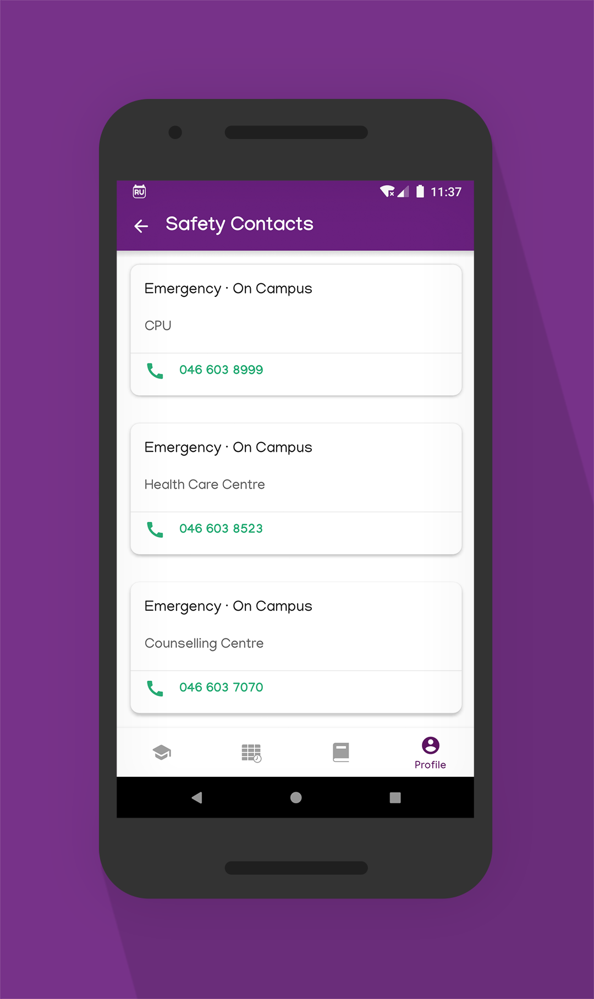

# RUCompanion App

## What is it?
The app allows Rhodes University students to:
* Plan their day by creating their custom agenda
* View their weekly/daily timetable
* Recieve push notifications of upcoming classes & tests

## Screenshots

